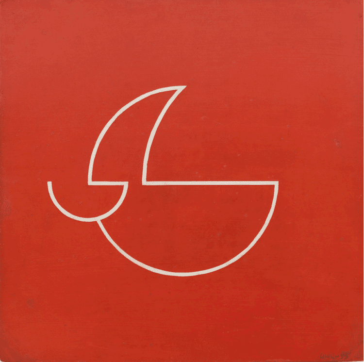

# Artes Multimediales 1 - Cátedra Lacabanne -  2026

Repositorio de cursada para la materia **Artes Multimediales 1**. Aquí se centralizan las Actividades de Consolidación de Saberes (ACS), los Trabajos Prácticos (TP) y los procesos de experimentación con p5.js.

Programa de la materia:
https://am1-lacabanne.netlify.app/


## ACS: Actividades de consolidación de saberes

### ACS1: Waldemar Cordeiro

[Link a la ACS1: Waldemar Cordeiro](https://macavilla.github.io/am1_lacabanne_2026/sketches/acs1/index.html)

En base a la siguiente obra de [Waldemar Cordeiro](https://www.waldemarcordeiro.com/concrete), artista concreto brasilero, desarrollé un trabajo de mímesis usando p5.js:

 


---

## 📂 Estructura del Proyecto

El repositorio utiliza una arquitectura de **monorepo simplificado** para mantener cada ejercicio de p5.js encapsulado y funcional de forma independiente.

```text
am1-lacabanne_2026/
├── docs/               # Notas de clase, bibliografía y bitácora (.md)
├── shared/             # Assets globales (imágenes, fuentes, sonidos)
├── sketches/           # Laboratorio y Actividades de Consolidación (ACS)
│   ├── _template/      # Célula madre para nuevos proyectos
│   ├── acs1-nombre/    # Ejercicio técnico específico
│   └── lab-prueba/     # Experimentación libre
├── tps/                # Trabajos Prácticos oficiales (instancias obligatorias)
│   └── tp1-generativo/ # Entrega con informe y restricciones específicas
├── .gitignore          # Configuración de archivos ignorados (node_modules, DS_Store)
└── README.md           # Índice general (este archivo)

```