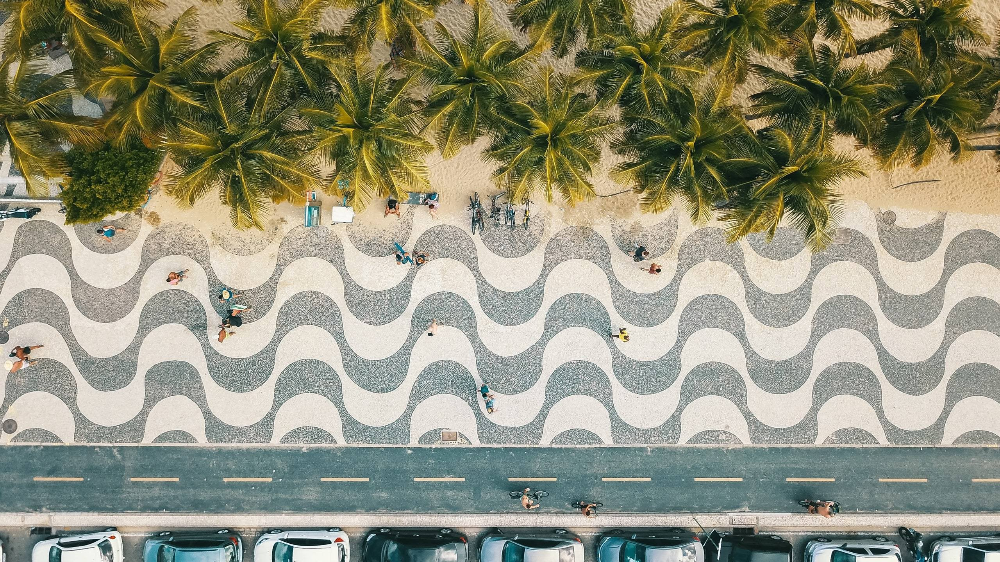

# Roberto Burle Marx

Paisajista brasilero modernista, 

El de la famosísima Calçadão de Copacabana

Según https://altamontanha.com/burle-marx/
Vemos o resultado do trabalho, mas raramente pensamos nos princípios que o organizam. A obra de Burle Marx é baseada em vários fundamentos.

Analogia e contraste são dois deles: plantas semelhantes opostas a cores, volumes e texturas diferentes. Quando não existe este contraste, então ele recorre à simples repetição, com espécies e formas recorrentes. Outro recurso é o isolamento, quando plantas exclusivas são separadas e destacadas.

Vou dar alguns exemplos. A repetição pode ser encontrada nas formas de ondas das pedras portuguesas que decoram a orla de Copacabana – que na realidade ele manteve, ou melhor, ampliou e reformou, pois a calçada anterior era mais estreita.

Os gramados rasteiros interrompidos por moitas volumosas ou por cores diferentes representam o contraste. A enorme árvore de tamboril que sombreia o centro do jardim de Inhotim é uma amostra de um elemento isolado. As diferentes palmáceas do jardim no seu sítio em Guaratiba traduzem o efeito de analogia.